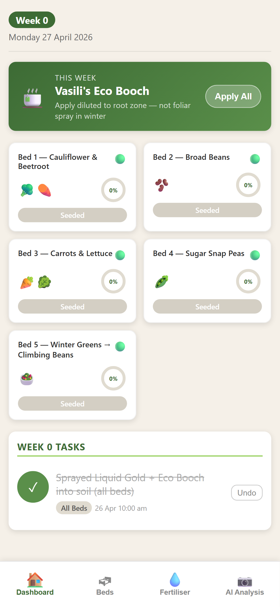
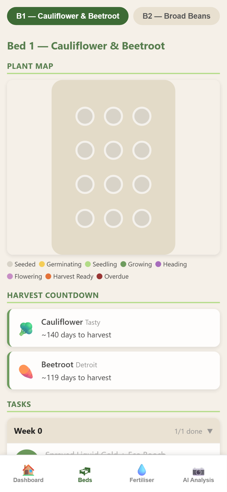
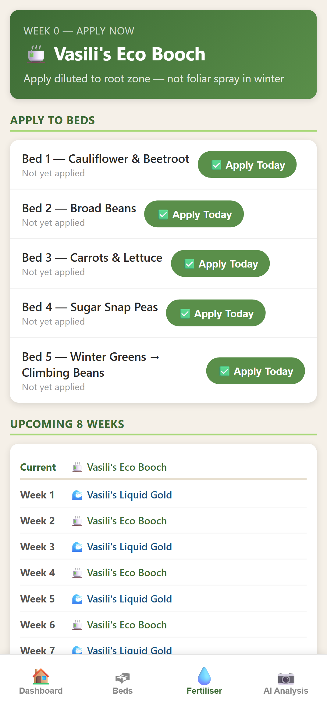
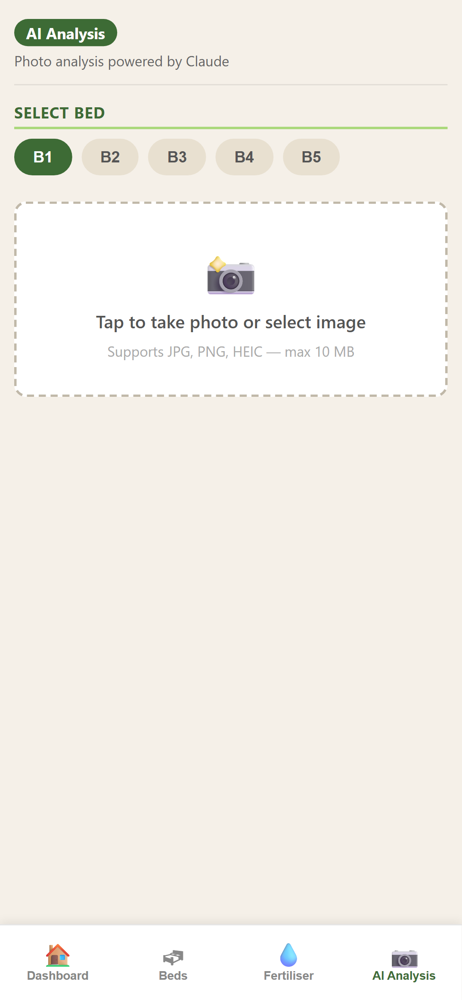
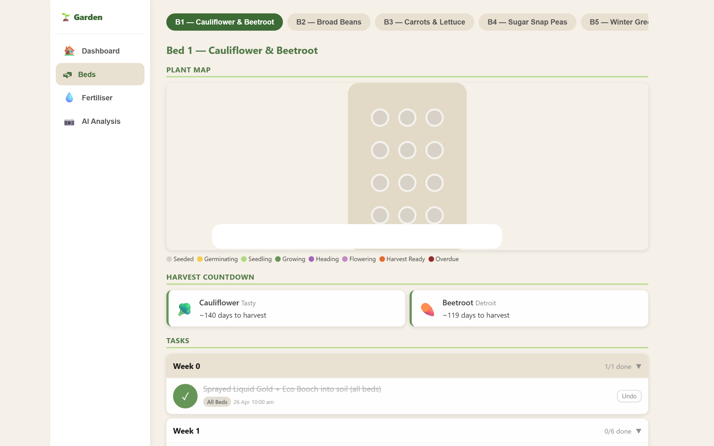

# Garden Tracker

A personal raised-bed garden management tool for five beds. Tracks the weekly task schedule, fertiliser rotation, plant growth stages, and provides AI photo analysis of bed health. Built to be used standing in the garden on a phone — high contrast, large touch targets, no friction.

## Screenshots

| Dashboard | Beds | Fertiliser | AI Analysis |
|---|---|---|---|
|  |  |  |  |

**Desktop view** — sidebar navigation, wider grid layout:



## Features

- **Dashboard** — current week, this week's fertiliser, bed status grid, completed task log
- **Beds** — per-bed plant map, growth stage colour coding, harvest countdown, per-week task accordion, notes
- **Fertiliser** — one-tap "Apply Today" per bed, 8-week rotation schedule
- **AI Analysis** — upload a photo of any bed, Claude analyses it for health issues, pests, and recommendations
- Responsive: mobile bottom-nav on phones, sidebar on desktop (≥768px)
- Works without an Anthropic API key — AI tab shows a clear disabled state

## Stack

- **Backend:** Node.js, Express, better-sqlite3 (synchronous, single-process)
- **Frontend:** Vanilla JS SPA, single HTML file, no framework, no bundler
- **AI:** Anthropic Claude (`claude-sonnet-4-20250514`) via multipart image upload
- **Infra:** Docker, GitHub Container Registry (`ghcr.io`), deployed on Proxmox

## Running locally

```bash
# Clone
git clone https://github.com/zpeed260/garden-tracker.git
cd garden-tracker

# Install dependencies
npm install

# Start (AI analysis requires the key; the app boots fine without it)
ANTHROPIC_API_KEY=sk-ant-... npm start
# or just: npm start   (AI tab will show a 503 message)
```

Open [http://localhost:3000](http://localhost:3000).

The database is created and seeded automatically on first boot at `./garden.db` (local) or `/app/data/garden.db` (Docker).

## Running with Docker

Pull the pre-built image from GitHub Container Registry:

```bash
docker compose up -d
```

The `docker-compose.yml` uses `ghcr.io/zpeed260/garden-tracker:latest`. The `ANTHROPIC_API_KEY` environment variable is optional — set it in a `.env` file alongside `docker-compose.yml` if you want AI analysis:

```env
ANTHROPIC_API_KEY=sk-ant-...
```

To update to the latest image:

```bash
docker compose down
docker compose pull
docker compose up -d
```

Data is persisted in the `garden-data` Docker volume and survives image updates.

## Adapting for your own garden

All beds, plants, and the task schedule are seeded from `server.js` on first boot (when the database is empty). To change them:

1. **Delete or rename the database** so it re-seeds: `docker volume rm garden-tracker_garden-data` (Docker) or delete `garden.db` (local).
2. **Edit the seed data** in `server.js`:
   - Beds: the `beds` array in the `seedDatabase()` function
   - Plants: the `plants` array — each entry has `name`, `variety`, `planted_date`, `emoji`, and `stage_thresholds` (a JSON object mapping stage name → days since planting)
   - Tasks: the `tasks` array — each entry has `bed_id` (or `null` for all-beds), `week`, and `title`
3. **Update the season epoch** — `SEASON_START` near the top of `server.js`. Week numbers are computed from this date.
4. **Update the fertiliser names** in `getFertiliserForWeek()` if you use different products (currently alternates between Vasili's Liquid Gold and Vasili's Eco Booch by week parity).
5. Restart the app — it will re-seed with your data.

> The AI analysis prompt in `POST /api/analyse` references Eltham, Victoria (cool climate, USDA zone 10a). Edit the system prompt in that route if your location differs.

## Environment variables

| Variable | Default | Purpose |
|---|---|---|
| `ANTHROPIC_API_KEY` | — | Enables AI photo analysis. App works without it. |
| `PORT` | `3000` | HTTP port |
| `DB_PATH` | `/app/data/garden.db` | SQLite file location |

## Development

No build step. Edit `server.js` (backend) or `public/index.html` (frontend) and restart the server.

### Running E2E tests

```bash
# Install Playwright browsers once
npx playwright install chromium

# Start the app on port 3001 (tests use a separate DB)
PORT=3001 DB_PATH=./test-e2e.db npm start &

# Run tests
npx playwright test

# View HTML report
npx playwright show-report
```

Tests cover all four tabs, bed detail, task accordion, fertiliser apply flow, AI analysis UI, and the desktop sidebar layout. Screenshots are saved to `tests/e2e/screenshots/`.

## CI / CD

Two GitHub Actions workflows:

- **`e2e.yml`** — runs Playwright tests on every push to `master`, uploads screenshots and HTML report as artifacts (30-day retention)
- **`docker-publish.yml`** — builds and pushes the Docker image to `ghcr.io/zpeed260/garden-tracker` on every push to `master`, tagged `latest` and `sha-<short>`

## How this was built

This project was built entirely with [Claude Code](https://claude.ai/code) using the following agents and skills:

### Claude Code agents

| Agent | Role |
|---|---|
| `fullstack-dev` | Primary builder — all Express routes, SQLite schema, and frontend HTML/CSS/JS |
| `garden-expert` | Domain advisor — reviewed stage thresholds, fertiliser timing, task schedule accuracy, and the AI analysis prompt for cool-climate Melbourne conditions |
| `e2e-runner` | QA — wrote and maintained the Playwright test suite, fixed selector stability issues |
| `code-reviewer` | Reviewed each implementation task for quality, security, and correctness |
| `security-reviewer` | Audited for exposed secrets, input validation, and safe API handling |
| `build-error-resolver` | Fixed build and dependency issues (missing `package-lock.json`, Docker layer caching) |
| `doc-updater` | Generated and maintained `CLAUDE.md` |

### Impeccable skills

| Skill | What it did |
|---|---|
| `$impeccable teach` | Interviewed the project to produce `PRODUCT.md` — users, brand personality, anti-references, design principles |
| `$impeccable document` | Analysed the live codebase and generated `DESIGN.md` + `DESIGN.json` — a full design system token set with color palette, typography, elevation, and component specs |
| `$impeccable polish` | Applied a final quality pass across all UI pages — improved hover/focus states, reduced-motion support, fixed a border style violation, promoted interactive elements to proper `<button>` elements |
